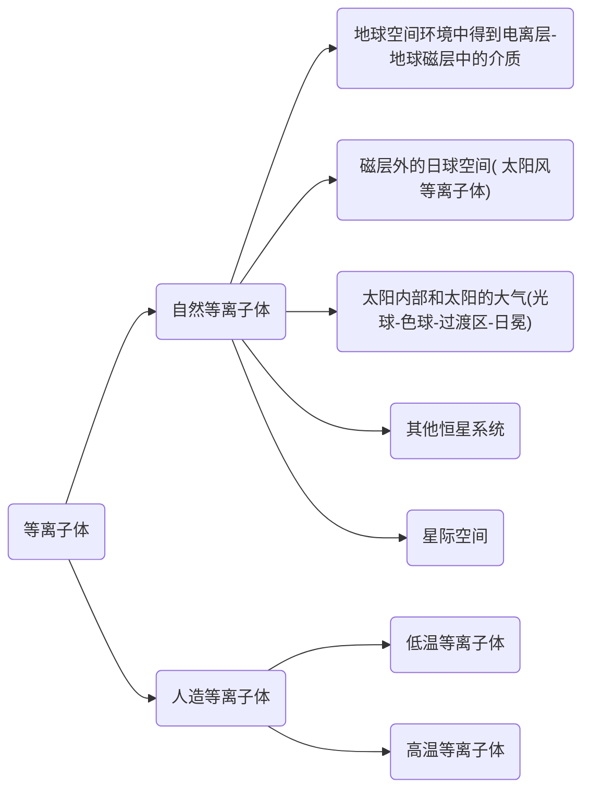

# 1.0 等离子体分类

+ 低温等离子体,主要与工业和国防有关,包括等离子体显示、刻蚀、清洗、天线与隐身等一系列技术中所涉及的等离子体;

+ 高温等离子体,主要指受控热核聚变中的等离子体

***

# 1.1 等离子体的“电性”与集体行为

+ 物质的第四态：等离子体
  + 一般，通过持续加热或者气体放电等方式，使得气体（原子、分子）温度升高、热运动加剧、粒子动能增加。当粒子动能增加到与其第一电离能相近时，粒子间的碰撞就有可能将原子或分子电离，产生带正电的离子和带负点的电子，即为**电离过程**;
  
  + ==电离度==:可以将**电离成分数密度**与发生电离前中性成分数密度之比定义为电离度$\alpha$。
  
    + $\alpha$主要由气体的**温度**和**密度**所决定；

    + 粒子运动动能与电离能相差较远时，电离度相应很低；

    + 除开温度参数以外，气体的数密度不能太高，否则，刚电离出的电子很有可能立刻被周围的离子捕获而发生复合过程，无法存在很长时间。

    + **欲使电流度很大，应当使得温度尽可能高，密度尽可能低**。

+ 电性与中性

  + 部分电离的气体中可以同时存在中性成分和电离成分，故存在**中性成分间、中性与电荷间以及电荷间的相互作用**，前两者（“中性”）与普通气体中的作用形式没有区别，而后者是新出现的作用形式（“电性”）；

  + 随着电离度的增加，将会出现越来越多的电荷，电荷间的作用对系统性质和演化的影响就会越来越大。当“电性”的影响超过“中性”的影响时，气体的性质与普通气体就会出现显著差异，而成为“等离子体”态；

  + “电性”所产生的一个重要效应就是等离子体的集体相互作用。多体长程的库伦相互作用，使得发生于某处的电荷扰动（如密度变化、位置移动）会波及周围的电荷，使它们感受到变化的库仑力而响应扰动；这又将扰动进一步扩大范围，

  + 等离子体对扰动的响应总是会有诸多粒子参与，这就是集体行为(Collective behavior)或者集体相互作用，是等离子体区别于气体的最重要的性质.

***

# 1.2 集体行为的集中表现与等离子体判据

## 等离子体振荡

$$
\begin{eqnarray}
E&=&4\pi en_0\delta_x \tag{1}\\
m_e\frac{d^2\delta_x}{dt^2}&=&-eE\tag{2}\\
&=&-4\pi e^2n_0\delta_x\\
\ddot{x}+\frac{4\pi e^2n_0 }{m_e}x&=0&\tag{3}\\
\omega^2&=&4\pi\frac{ n_0e^2}{m_e}
\end{eqnarray}
$$

​                                          
$$
\begin{eqnarray}
\frac{n_0e}{\epsilon_o}\frac{4\pi\delta_x^3}{3}&=&\int_{S}\vec{E}d\vec{S}

\end{eqnarray}
$$
​                                                                                                                                    

